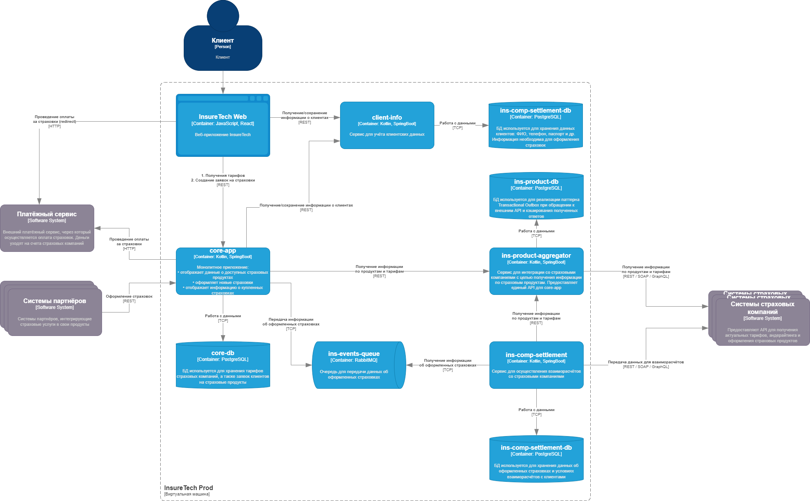

# Текущие проблемы
1. Сильная связанность сервисов core-app, ins-comp-settlement, ins-product-aggregator и API страховых компаний из-за синхронного взаимодействия.
2. Периодические задержки ответов или ошибки при взаимодействии с API страховых компаний.
3. Сильная связанность сервисов ins-comp-settlement и core-app при получении всех оформленных за день страховок из-за синхронного взаимодействия.

# Потенциальные проблемы и риски при росте нагрузки (увеличении числа страховых компаний)
1. Время отклика ins-product-aggregator увеличится пропорционально, т.к. сервису придётся ждать ответа от большего количества внешних систем.
2. Вероятность ошибок при взаимодействии с API страховых компаний возрастёт.
3. Количество оформленных за день страховок возрастёт, что также приведёт к увеличению времени отклика и вероятности ошибок во взаимодействии сервисов ins-comp-settlement и core-app.

# Анализ back-to-back взаимодействий
1. **ins-product-aggregator - API страховых компаний** — вынужденно синхронное взаимодействие типа "точка-точка". Можно повысить надёжность взаимодействия, используя паттерн Transactional Outbox.
2. **core-app, ins-comp-settlement - ins-product-aggregator** — синхронное взаимодействие типа "точка-точка". Если оптимизация ins-product-aggregator позволит обеспечить необходимое время отклика, то можно оставить имеющийся способ взаимодействия. В противном случае - перейти на репликацию данных через "публикацию-подписку".
3. **ins-comp-settlement - core-app** — синхронное взаимодействие типа "точка-точка". Триггером изменения данных служит событие — оформление страховки. Сервису, где событие возникает (core-app), достаточно передать данные, не ожидая ответа. Поэтому данное взаимодействие можно также реализовать асинхронно по типу "публикация-подписка".

# Предлагаемые решения
1. Заменить опосредованно синхронный способ взаимодействия сервисов core-app, ins-comp-settlement и API страховых компаний на асинхронный, реализовав в сервисе ins-product-aggregator паттерн Transactional Outbox с сохранением ответа от внешних систем. Теперь ins-product-aggregator сможет независимо актуализировать данные по каждой страховой компании, кэшировать эти данные у себя и оперативно предоставлять их сервисам core-app и ins-comp-settlement по синхронным запросам. При необходимости, если сервисам core-app и ins-comp-settlement потребуется более частая актуализация данных (а не раз в 15 минут и раз в сутки, как сейчас), можно реализовать согласование кэша ins-product-aggregator и локальных реплик сервисов, используя CDC.
2. Представить оформляемые за день страховки как поток событий и организовать асинхронную передачу данных из core-app в ins-comp-settlement через брокер сообщений, реализуя Event Streaming. Это позволит разорвать синхронную связь между сервисами, повысить их независимость друг от друга и снизить нагрузку на сервис core-app. Максимальная зафиксированная нагрузка по запросам оформления страховок — 10 RPS. Это позволяет использовать в качестве брокера RabbitMQ, тогда как применение Kafka выглядит избыточным.

Решения отражены на обновлённой диаграмме контейнеров **InsureTech_C4_сontainer-diagram_to-be.drawio**:

