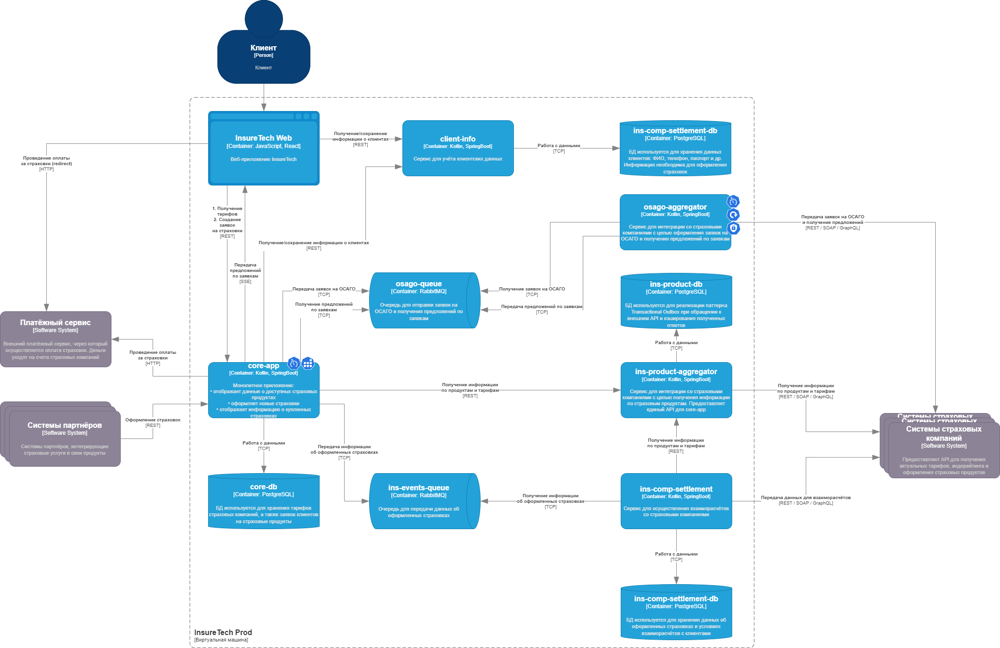

# Предлагаемые решения по сервису osago-aggregator

1. Поскольку предложение формируется страховой компанией под конкретную заявку в конкретный момент времени, кэширование на стороне osago-aggregator ответов от страховых компаний не имеет смысла. 
Обязательность отправки запроса внешней страховой компании имеет жёсткие временные рамки (ответ от неё в любом случае ожидается не более 60 секунд), поэтому для её обеспечения достаточно реализации паттерна Retry. 
В виду указанных причин своё хранилище данных сервису osago-aggregator не требуется.

2. Взаимодействие между сервисами core-app и osago-aggregator должно иметь тип "точка-точка", т.к. core-app отправляет в osago-aggregator команду для создания заявки на ОСАГО и ожидает данные конкретно по этой команде. 
При этом osago-aggregator должен иметь возможность возращать данные по мере прихода ответов от страховых компаний, чтоб core-app мог сразу передавать эти данные клиенту, поэтому взаимодействие сервисов также должно быть асинхронным. 
Оптимальным решением для организации такого взаимодействия будет брокер сообщений. Поскольку core-app потребуется фильтровать данные по конкретной заявке, и лучше это выполнять в брокере, нам подойдут RabbitMQ и Apache ActiveMQ Artemis, но не Kafka. Нагрузка в пике может составлять 2,5 тысячи человек, поэтому оба решения подойдут по производительности, но у RabbitMQ — более развитое комьюнити, поэтому выбор остановим на нём.
Использование брокера также облегчает масштабирование сервисов core-app и osago-aggregator: при синхронном взаимодействии увеличение количества экземпляров core-app потребовало бы пропорционального роста количества экземпляров osago-aggregator, тогда как брокер позволяет снизить это влияние роста нагрузки, выступая в качестве буфера.

3. Важной особенностью клиентского пути при оформлении ОСАГО является возможность увидеть предложение от страховой компании сразу, как только от неё придёт ответ, не дожидаясь ответов от всех страховый компаний. Оптимальную реализацию этой возможности обеспечивает паттерн Server Push: по мере получения ответов от сервиса osago-aggregator сервис core-app будет передавать эти ответы веб-приложению. Поскольку эта передача будет односторонней, достаточно применить технологию SSE (Server sent events).

4. Для обеспечения отказоустойчивости применим следующие паттерны:

    Rate Limiting — на стороне core-app для предотвращения избыточной нагрузки на osago-aggregator при попытках отправки одним клиентом множества заявок.
    
    Circuit Breaker — применяем на стороне osago-aggregator, чтоб не ожидать ответов от страховых компаний, имеющих проблемы с доступностью.
    
    Retry — применяем на стороне osago-aggregator для исключения влияния кратковременных проблем с доступом к API страховых компаний.
    
    Timeout — применяем на стороне core-app и osago-aggregator, чтоб не ожидать ответов от оставшихся страховых компаний дольше заданного лимита.

Решения отражены на обновлённой диаграмме контейнеров **InsureTech_C4_сontainer-diagram_to-be.drawio**: 

